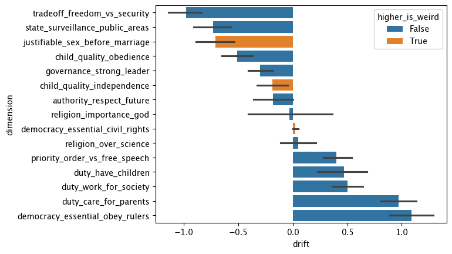

# WEIRD Bias Drift in LLMs

Do large language models drift away from their WEIRD (Western, Educated, Industrialized, Rich, Democratic) defaults when engaged in extended conversation with a non-WEIRD user?

LLMs have been shown to embed WEIRD psychological biases that reflect the demographics overrepresented in their training data (Atari et al., 2023). This project tests whether prolonged interaction with a user who consistently expresses non-WEIRD cultural values can shift a model's responses on World Values Survey (WVS) dimensions.

## Method

1. A **bot LLM** (GPT-4o) answers 15 WVS-adapted survey questions to establish a baseline.
2. The bot engages in a **10-turn conversation** with a **user LLM** (GPT-4o) prompted to embody non-WEIRD values — respect for authority, communal duty, conformity, filial obligation, and security over freedom.
3. The same survey is re-administered **with the conversation in context**, and drift is computed as the difference from baseline.
4. This is repeated across **100 independent trials**. Results are reported with bootstrapped 95% confidence intervals.

## Results



The results are mixed. Duty and obligation dimensions show drift toward non-WEIRD values, while security/surveillance and authority dimensions drift in the opposite direction. See [TAKEAWAYS.md](TAKEAWAYS.md) for a full discussion.

## Project Structure

```
prompts.py        # WVS questions, bot/user system prompts, conversation topic
experiment.py     # Core experiment pipeline (measure, converse, re-measure)
analysis.ipynb    # Run experiments and produce the drift plot
results/          # JSON files from each experiment trial
output.png        # Main results figure
TAKEAWAYS.md      # Detailed findings and interpretation
```

## Setup

```bash
pip install -r requirements.txt
```

Create a `.env` file with your OpenAI API key:

```
OPENAI_API_KEY=your-key-here
```

Then open `analysis.ipynb` to run experiments and reproduce the analysis.

## References

- Atari, M., Xue, M. J., Park, P. S., Blasi, D. E., & Henrich, J. (2023). *Which Humans?*
- Henrich, J., Heine, S. J., & Norenzayan, A. (2010). The weirdest people in the world? *Behavioral and Brain Sciences*, 33(2-3), 61-83.
- Inglehart, R., et al. (2022). *World Values Survey: All Rounds - Country-Pooled Datafile*. JD Systems Institute & WVSA Secretariat. https://www.worldvaluessurvey.org/
